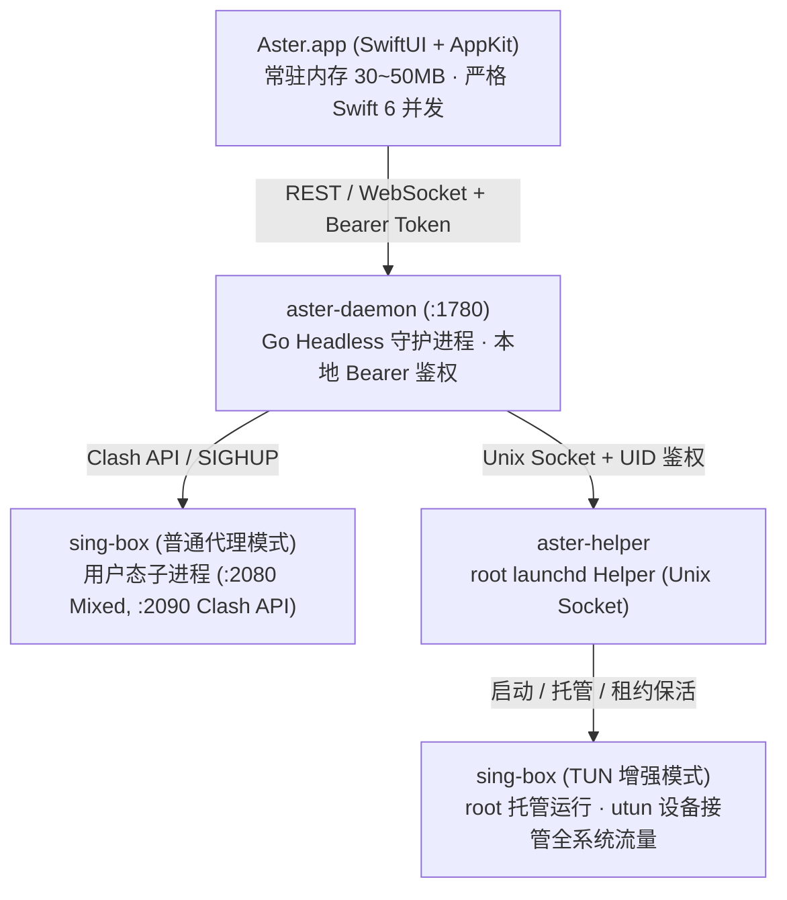

# Aster

<p align="center">
  
</p>

<p align="center">
  <strong>极致轻量的 Apple Silicon（macOS 14+ arm64）原生 sing-box 客户端</strong><br/>
  融合 <strong>Surge</strong> 的高保真网络感知与 Bento 美学，汲取 <strong>Sparkle</strong> 的网络治理与配置持久化流水线
</p>

<p align="center">
  <a href="LICENSE"></a>
  <a href="https://github.com/velctmo/Aster/actions/workflows/ci.yml"></a>
  <a href="https://go.dev/"></a>
  <a href="https://developer.apple.com/swift/"></a>
  <a href="https://developer.apple.com/macos/"></a>
  <a href="https://github.com/SagerNet/sing-box"></a>
</p>

<p align="center">
  <a href="README.md"><strong>简体中文</strong></a> •
  <a href="README_EN.md"><strong>English</strong></a>
</p>

---

## 🌟 核心设计与产品定位

Aster 专为 macOS Apple Silicon 架构打造，彻底告别基于 Electron 或跨平台框架客户端动辄数百兆的内存膨胀与高空闲 CPU 占用。Aster 采用 **纯原生 Swift 6 (SwiftUI + AppKit)** 构建前端，搭配高效的 **Go headless 守护进程（aster-daemon）** 作为中枢，直驱 **sing-box** 高性能通用代理核心。

- **极低常驻开销**：客户端常驻内存严格维持在 **30MB ~ 50MB**，桌面悬浮窗空闲 CPU 占用趋近于 **0%**。
- **Surge 级网络感知与 Bento 交互**：原汁原味还原网络拓扑横栏、三级延时指示灯、上下行波形示波器、24小时流量时序柱状图与独立抓包视窗。
- **工业级特权隔离架构**：拒绝 SUID 与重复提权弹窗，采用 root `launchd` 辅助守护进程配合受控 Unix Socket，基于系统 UID 强校验与 20 秒租约机制保障系统安全。
- **配置持久化与智能清洗**：机场节点清洗、用户分流规则锁定覆写，更新订阅再也不会冲掉自定义策略。

---

## 📸 核心特性一览

### 1. 「活动 (Activity)」Bento 监控仪表盘
- **网络拓扑概览**：动态显示当前接入网络类型（以太网 / Wi-Fi）、活动配置、分流策略模式切换（智能规则 / 全局代理 / 直接连接）以及公网真实 IP vs 代理出口 IP 详情。
- **三级延时诊断**：并发探测 `本地网关 (ICMP/TCP)`、`系统 DNS (UDP 53 递归)` 与 `代理节点往返耗时`，网络故障一眼锁定。
- **高密度遥测示波器**：上下行瞬时速率示波条、活动连接池动态指标、24 小时流量时序柱状图（支持按客户端进程、目标域名、分流策略多维度钻取）。

### 2. 状态栏现代 NSPopover 交互与实时感知
- **原地交互保留**：点击“全部测速”面板绝不关闭，微型 Spinner 原地旋转并结合 WebSocket 逐个流式点亮节点最新延迟，杜绝页面跳动。
- **活跃 App 实时速率 Top 榜**：菜单自动列出当前活跃传输的应用进程，自动抓取 macOS 本地高清应用图标（如 Chrome、Telegram、Cursor 等）并显示瞬时网速。
- **快捷键直达**：支持 `⌘M`（主窗口）、`⌘D`（抓包面板）、`⌘S`（系统代理）、`⌘E`（增强模式）、`⌘C`（一键复制终端代理配置命令）、`⌘R`（重载配置）。

### 3. 独立「抓包分析 (Inspector)」视窗 (`⌘D`)
- **6 大专业维度导航**：`最近请求`、`活动连接`、`DNS 查询`、`网络设备`、`流量统计` 与 `详细日志`。
- **高密度流水审计**：10 列专业字段（状态灯、时间戳、客户端图标+名称、命中规则、出口策略、时长、彩色协议徽标、目标地址及端口）。
- **右键快速规则注入**：从任意请求或连接记录中，右键一键生成 DIRECT / PROXY / REJECT 永久路由规则，免去手动编辑配置。

### 4. 严密的特权管理与 TUN 增强模式
- **免密码反复授权**：首次安装网络组件（`.pkg`）后，后续启停 TUN 增强模式无需输入管理员密码，也无需调用不安全的 `osascript` 脚本。
- **UID 强校验 & 20秒租约自毁**：特权辅助进程仅允许当前控制台登录用户的 UID 调用，主程序异常退出 20 秒后自动停机并还原系统代理，不留网络故障后患。

### 5. 高级网络感知与云端生态
- **日常流量被动伴随采样 (EMA)**：在用户日常上网时，底层静默采样 TCP 建连握手 RTT，经滑动加权滤波动态更新节点延迟，常用节点越用越准。
- **多探针靶点高可用池**：内置 Google 204、Cloudflare、Apple Captive Portal 及用户自定义探针，2500ms 快速熔断，彻底解决单一探针被污染导致的测速不准问题。
- **真实峰值带宽吞吐测速**：单节点一键真实下载 CDN 切片，并在节点卡片显示 `⚡️ Mbps` 真实峰值带宽徽标。
- **iCloud Drive 零配置同步**：自动接入 macOS iCloud 容器，多台 Mac 之间安全同步配置，并支持 WebDAV 凭据备份与迁移。

---

## 🏗️ 架构拓扑



---

## 📥 下载与安装

### 推荐方式：GitHub Releases
前往 [Releases 页面](https://github.com/velctmo/Aster/releases) 下载最新版本：

1. **便携版本 (`Aster-macos-arm64.zip`)**：
   - 解压后得到 `Aster.app`，直接拖入 `/Applications` 应用程序文件夹即可使用。
   - 适用于普通系统代理模式（HTTP/SOCKS5）。
   - **首次运行提示拦截**：若 macOS Gatekeeper 提示“无法打开，因为无法验证开发者”，请在 Finder 中**右键点击 Aster.app → 打开**，或在终端执行：
     ```bash
     xattr -cr /Applications/Aster.app
     ```

2. **特权网络组件安装包 (`Aster.pkg`)**：
   - 若需要使用 **TUN 增强模式**（接管系统所有应用无代理设置流量），请安装一次 `.pkg` 安装包。
   - 安装器会以管理员权限向 macOS `launchd` 注册专属 `aster-helper`，之后使用 TUN 模式再也不需要输入密码。

---

## 🛠️ 从源码构建

### 环境要求
- 硬件：Apple Silicon Mac (`arm64`)
- 系统：macOS 14.0 (Sonoma) 或更高版本
- 工具链：
  - Go 1.22+
  - Xcode 15+ 或 Command Line Tools (`xcode-select --install`)
  - `sing-box` 1.14.0+（构建脚本会自动从官方 Release 下载校验并缓存至 `vendor/cores/`）

### 常用构建命令

```bash
# 1. 克隆代码仓库
git clone https://github.com/velctmo/Aster.git
cd Aster

# 2. 运行后端单元测试与竞态检测
make test

# 3. 编译并产出完整应用包 (build/Aster.app 与 build/Aster-macos-arm64.zip)
make app

# 4. 生成带网络组件特权授权的 PKG 安装包 (build/Aster.pkg)
make pkg

# 5. 运行基准压测（500 节点渲染与 100 并发连接）
make benchmark

# 6. 一键运行本地构建的应用
make run
```

---

## ⚙️ 配置模式与安全边界

### 配置模式
- **订阅模式**：导入现成的 sing-box 完整配置（JSON 文件或 URL）。Aster 原样校验并加载，不擅自修改任何路由与入站逻辑。
- **节点模式**：输入一个或多个机场订阅 URL。Aster 负责拉取、节点清洗、自动装配优质 DNS 策略、智能分流规则与出站选择器。
- **脚本覆写**：支持基于沙箱的 JavaScript 转换函数 `transform(nodes, profile)`，在不破坏节点既有 ID 的前提下自定义节点过滤与排序。

### 安全与隐私边界
- **本地 IPC 安全**：Go 守护进程只监听 `127.0.0.1`，API 请求通过随机动态生成的 Bearer Token 验证，Origin 严格限制在本地，杜绝跨站脚本伪造（CSRF）与 DNS 重绑定（DNS Rebinding）攻击。
- **诊断数据脱敏**：内置的「导出诊断报告」仅包含脱敏后的硬件架构、系统版本、网络往返延时与运行日志，**严禁且绝不会**包含任何订阅 URL、节点服务器地址、密码、密钥或脚本源码。

---

## 🤝 参与贡献

我们欢迎社区各类形式的贡献（包括提交 Issue 反馈缺陷、提出新特性建议或直接发起 Pull Request）。

- 提交代码前，请先查阅 [CONTRIBUTING.md](CONTRIBUTING.md)。
- 报告漏洞与安全隐患，请查阅 [SECURITY.md](SECURITY.md)。
- 详细的功能演进记录请查阅 [CHANGELOG.md](CHANGELOG.md)。

---

## 📄 开源许可证

本项目基于 [MIT License](LICENSE) 开源。
