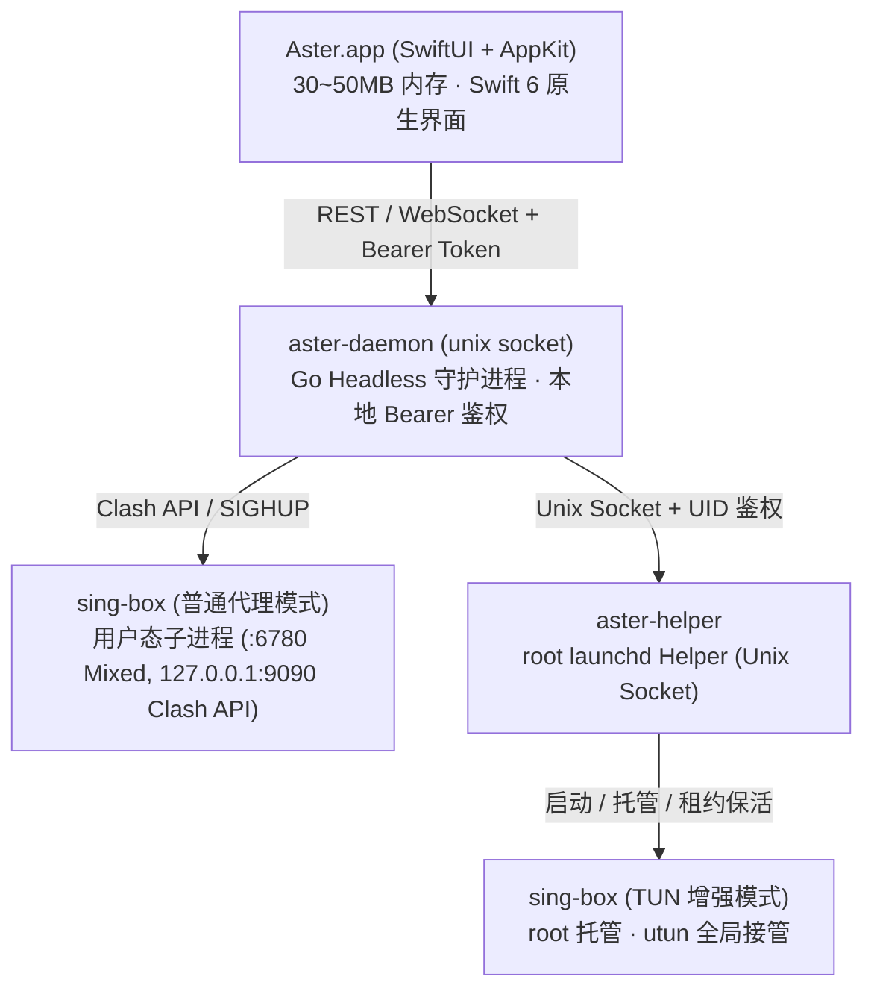

# Aster

<p align="center">
  
</p>

<p align="center">
  <strong>专为 Apple Silicon（macOS 14+）打造的极致轻量原生代理客户端</strong><br/>
  基于 <strong>SwiftUI + AppKit</strong> 原生界面与 <strong>Go</strong> 无头守护进程，直驱高性能 <strong>sing-box</strong> 核心
</p>

<p align="center">
  <a href="LICENSE"></a>
  <a href="https://github.com/velctmo/Aster/actions/workflows/ci.yml"></a>
  <a href="https://go.dev/"></a>
  <a href="https://developer.apple.com/swift/"></a>
  <a href="https://developer.apple.com/macos/"></a>
  <a href="https://github.com/SagerNet/sing-box"></a>
</p>

<p align="center">
  <a href="README.md"><strong>简体中文</strong></a> •
  <a href="README_EN.md"><strong>English</strong></a>
</p>

---

## 💡 项目简介

Aster 是一款专注于极致能效、原生体验与深度网络感知的 macOS 代理工具。拒绝跨平台框架臃肿低效的运行开销，Aster 采用 Swift 6 原生 UI 与 Go 守护进程解耦设计：

- **极简能效**：常驻内存仅 **30MB ~ 50MB**，桌面毛玻璃悬浮窗空闲 CPU 占用趋近于 **0%**。
- **直观感知**：全景 Bento 仪表盘呈现网络拓扑、三级延时分解与 24 小时流量时序示波。
- **安全隔离**：零 SUID 提权设计，借助受限 Unix Socket 与控制台 UID 强校验，实现 TUN 模式免重复密码授权。

---

## ✨ 核心特性

- **📊 实时网络拓扑与 Bento 仪表盘**：
  - 动态呈现当前网卡、分流模式与真实 IP / 代理出口 IP 对比；
  - 并发探测网关、系统递归 DNS 与节点往返耗时，三级网络延时一目了然；
  - 毫秒级上下行动态波形示波器与 24 小时多维度流量柱状图。
- **⚡️ 原生状态栏与流式交互**：
  - 基于现代 `NSPopover` 架构，测速时不关闭菜单，节点延迟逐个流式点亮；
  - 实时抓取活跃网络 App 本地高清图标与瞬时速率排行榜；
  - 全局快捷键：`⌘M`（主窗口）、`⌘D`（抓包视窗）、`⌘S`（系统代理）、`⌘E`（增强模式）、`⌘C`（复制终端代理命令）。
- **🔍 独立抓包分析视窗 (`⌘D`)**：
  - 支持按客户端或域名筛选的高密度 10 列请求流水表；
  - 单击/右击任意连接，一键将目标域名或 IP 沉淀为直连、代理或拦截规则。
- **🛡️ 工业级特权边界**：
  - 首次通过 PKG 安装网络组件后，启停 TUN 增强模式无需重复输入管理员密码；
  - 严格限制仅当前控制台 UID 可调度特权 Helper，附带 20 秒异常退出安全停机租约。
- **⚙️ 智能感知与配置编排**：
  - **规则覆写流水线**：更新订阅不丢失自定义分流策略与 DNS 设定；
  - **多端同步**：零配置自动接入 macOS iCloud Drive，支持 WebDAV 凭据备份与迁移。

---

## 🏗️ 架构概览



---

## 📥 下载与安装

前往 [Releases 页面](https://github.com/velctmo/Aster/releases) 下载最新构建：

1. **便携版 (`Aster-macos-arm64.zip`)**：解压后将 `Aster.app` 拖入「应用程序」文件夹即可直接运行（适用于普通系统代理模式）。
   > 若遭遇 Gatekeeper 提示，请在 Finder 中**右键点击 Aster.app → 打开**，或在终端执行 `xattr -cr /Applications/Aster.app`。
2. **网络组件安装包 (`Aster.pkg`)**：如需使用接管全局所有流量的 **TUN 增强模式**，请运行一次此安装包授权注册后台服务。

---

## 🛠️ 从源码构建

### 环境要求
- 架构：Apple Silicon Mac (`arm64`)
- 系统：macOS 14.0 或更高版本
- 工具链：Go 1.22+，Xcode 15+ 或 Command Line Tools

```bash
# 克隆仓库
git clone https://github.com/velctmo/Aster.git
cd Aster

# 运行测试
make test

# 编译应用包 (产出 build/Aster.app 与 build/Aster-macos-arm64.zip)
make app

# 构建特权组件安装包 (产出 build/Aster.pkg)
make pkg

# 运行应用
make run
```

---

## 📄 开源许可证

本项目基于 [MIT License](LICENSE) 开源发布。
