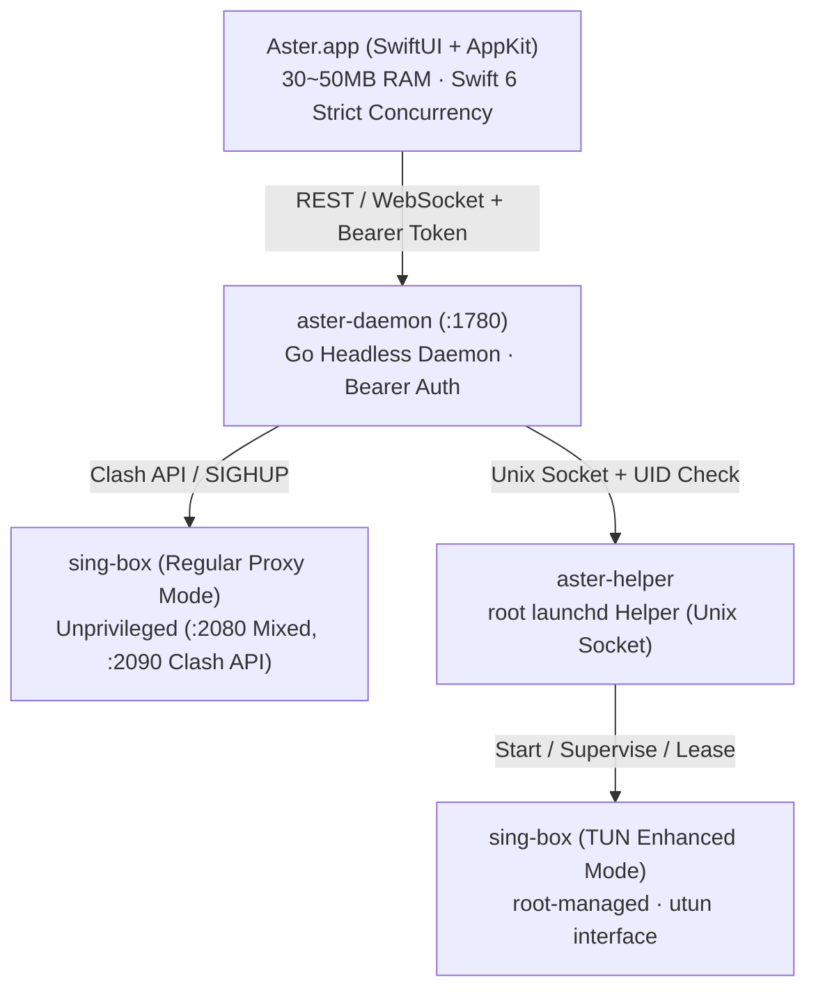

# Aster

<p align="center">
  
</p>

<p align="center">
  <strong>Ultra-lightweight native sing-box client for Apple Silicon (macOS 14+ arm64)</strong><br/>
  Combines <strong>Surge</strong>'s high-fidelity network telemetry and Bento aesthetic with <strong>Sparkle</strong>'s network governance and persistent configuration pipeline.
</p>

<p align="center">
  <a href="LICENSE"></a>
  <a href="https://github.com/velctmo/Aster/actions/workflows/ci.yml"></a>
  <a href="https://go.dev/"></a>
  <a href="https://developer.apple.com/swift/"></a>
  <a href="https://developer.apple.com/macos/"></a>
  <a href="https://github.com/SagerNet/sing-box"></a>
</p>

<p align="center">
  <a href="README.md"><strong>简体中文</strong></a> •
  <a href="README_EN.md"><strong>English</strong></a>
</p>

---

## 🌟 Philosophy & Core Design

Aster is engineered specifically for Apple Silicon macOS, discarding the heavy memory footprint and high idle CPU consumption typical of Electron or other cross-platform proxy clients. Aster pairs a **pure native Swift 6 (SwiftUI + AppKit)** graphical user interface with an efficient **Go headless daemon (`aster-daemon`)**, directly controlling the high-performance universal proxy core **sing-box**.

- **Minimal Resource Footprint**: Resident memory remains strictly within **30MB ~ 50MB**; the native desktop floating traffic monitor consumes **~0% idle CPU**.
- **Surge-Grade Telemetry & Bento UX**: High-fidelity reproduction of network topology headers, 3-tier latency diagnostics, real-time waveform oscilloscopes, 24-hour traffic timeline bar charts, and a standalone packet inspection window.
- **Zero-SUID Security Boundary**: Replaces dangerous SUID binaries and repetitive authorization dialogs with a root-owned `launchd` helper over a restricted Unix socket, enforcing strict console UID verification and a 20-second lease auto-expiration mechanism.
- **Persistent Rule Pipeline**: Go-native subscription cleaning removes fake nodes and adverts; user routing rules are layered persistently over subscriptions so profile updates never destroy custom routing.

---

## 📸 Key Features

### 1. "Activity" Bento Telemetry Dashboard
- **Topology Overview**: Real-time display of active network interfaces (Ethernet / Wi-Fi), active profile, outbound routing mode (Rule / Global / Direct), and dual public IP comparison (Direct Local IP vs Proxy Egress IP with geolocation details).
- **3-Tier Latency Diagnostics**: Concurrent latency probes for `Local Gateway (ICMP/TCP)`, `System DNS (UDP 53 recursion)`, and `Proxy Node Round-Trip Time`.
- **High-Density Telemetry Oscilloscope**: Real-time upload and download rate meters, active connection pool indicators, and 24-hour historical traffic timelines (drill down by Client Process, Target Hostname, or Outbound Policy).

### 2. Modern Status Bar NSPopover & Real-Time Awareness
- **In-Place Interactive Popover**: Clicking "Ping All" keeps the popover open while small spinners rotate in place and WebSocket streams latency updates one by one without jarring UI shifts.
- **Top Bandwidth Apps Leaderboard**: The menu dynamically lists active network-consuming applications, matching macOS local high-resolution app icons (e.g., Chrome, Telegram, Cursor) with instant transfer rates.
- **Global Shortcuts**: `⌘M` (Main Window), `⌘D` (Packet Inspector), `⌘S` (Toggle System Proxy), `⌘E` (Toggle Enhanced Mode), `⌘C` (Copy Terminal Proxy Exports), `⌘R` (Reload Configuration).

### 3. Standalone Packet Inspector Window (`⌘D`)
- **6 Professional Audit Tabs**: `Recent Requests`, `Active Connections`, `DNS Queries`, `Devices`, `Traffic Stats`, and `Logbook`.
- **High-Density Flow Audit**: 10-column table presenting status lights, timestamps, client app icon & name, matched routing rule, outbound policy, duration, protocol badge, and target host & port.
- **One-Click Rule Injection**: Right-click any connection or request to immediately insert permanent DIRECT / PROXY / REJECT routing rules without manually modifying configuration files.

### 4. Privilege Isolation & Enhanced Mode (TUN)
- **Zero Repetitive Prompts**: Install the network component (`.pkg`) once, and subsequent TUN start/stop actions require no administrator password dialogs and invoke no insecure `osascript` prompts.
- **Strict UID Validation & 20s Lease**: The privileged helper responds exclusively to the console user UID recorded at install time. If the main daemon exits unexpectedly, the helper automatically shuts down the core and restores system proxies after 20 seconds.

### 5. Advanced Perception & Cloud Ecosystem
- **Passive Latency Sampling (EMA)**: Passively measures TCP handshake RTT during ordinary web browsing and filters updates with Exponential Moving Average (EMA). Frequently used nodes become more accurate over time without active testing.
- **Multi-Probe Target Pool**: Built-in endpoints (Google 204, Cloudflare, Apple Captive Portal, and custom URLs) with a 2500ms circuit breaker to avoid false timeouts caused by DNS poisoning.
- **Peak Throughput Benchmark**: One-click download test against real CDN chunks to measure actual single-stream throughput displayed with a `⚡️ Mbps` badge.
- **Zero-Config iCloud Drive Sync**: Seamlessly syncs configuration profiles across Macs via `~/Library/Mobile Documents/com~apple~CloudDocs/Aster/`, with WebDAV credential backup support.

---

## 🏗️ Architecture



---

## 📥 Download & Installation

### Recommended: GitHub Releases
Visit the [Releases Page](https://github.com/velctmo/Aster/releases) to download the latest build:

1. **Portable Package (`Aster-macos-arm64.zip`)**:
   - Unpack to get `Aster.app` and drag it into your `/Applications` directory.
   - Recommended for standard system proxy modes (HTTP/SOCKS5).
   - **Gatekeeper Notice**: If macOS alerts that the developer cannot be verified, right-click `Aster.app` in Finder and select **Open**, or run the following in Terminal:
     ```bash
     xattr -cr /Applications/Aster.app
     ```

2. **Network Component Package (`Aster.pkg`)**:
   - Required if you intend to use **Enhanced Mode (TUN)** to capture traffic from applications lacking proxy settings.
   - The installer registers `aster-helper` under macOS `launchd` once with administrator authorization; subsequent TUN toggles require no credentials.

---

## 🛠️ Building from Source

### Prerequisites
- Hardware: Apple Silicon Mac (`arm64`)
- Operating System: macOS 14.0 (Sonoma) or newer
- Toolchain:
  - Go 1.22+
  - Xcode 15+ or Command Line Tools (`xcode-select --install`)
  - `sing-box` 1.14.0+ (the build script will automatically download, verify, and cache the official binary in `vendor/cores/`)

### Common Build Commands

```bash
# 1. Clone repository
git clone https://github.com/velctmo/Aster.git
cd Aster

# 2. Run backend test suite with race detector
make test

# 3. Build packaged application (build/Aster.app & build/Aster-macos-arm64.zip)
make app

# 4. Generate privileged installer package (build/Aster.pkg)
make pkg

# 5. Run performance benchmark (500-node rendering & 100 concurrent proxy clients)
make benchmark

# 6. Launch the built application
make run
```

---

## ⚙️ Configuration & Security Model

### Profile Modes
- **Subscription Mode**: Imports complete sing-box JSON configuration documents (local files or remote URLs). Aster validates and executes them without modifying inbounds, DNS, or routes.
- **Node Mode**: Takes one or more provider subscription URLs. Aster pulls endpoints, strips advertisements, and constructs clean sing-box DNS servers, intelligent routes, and selector groups.
- **Script Overrides**: Supports restricted JavaScript `transform(nodes, profile)` sandboxes to customize node filtering and sorting while preserving internal node identifiers.

### Security Boundaries
- **Local IPC Safety**: The Go daemon binds strictly to `127.0.0.1`. Requests require dynamic Bearer token authorization, and origins are strictly restricted to local origins to mitigate CSRF and DNS Rebinding threats.
- **Sanitized Diagnostics**: Exported diagnostics contain only scrubbed hardware metadata, OS versions, network round-trip timings, and runtime error logs. They **never** disclose subscription URLs, server hostnames, credentials, secrets, or transform scripts.

---

## 🤝 Contributing

Contributions from the community are warmly welcomed!

- Please read [CONTRIBUTING.md](CONTRIBUTING.md) before submitting pull requests.
- For vulnerability reports, please consult [SECURITY.md](SECURITY.md).
- Detailed version milestones and release notes are tracked in [CHANGELOG.md](CHANGELOG.md).

---

## 📄 License

Aster is released under the [MIT License](LICENSE).
