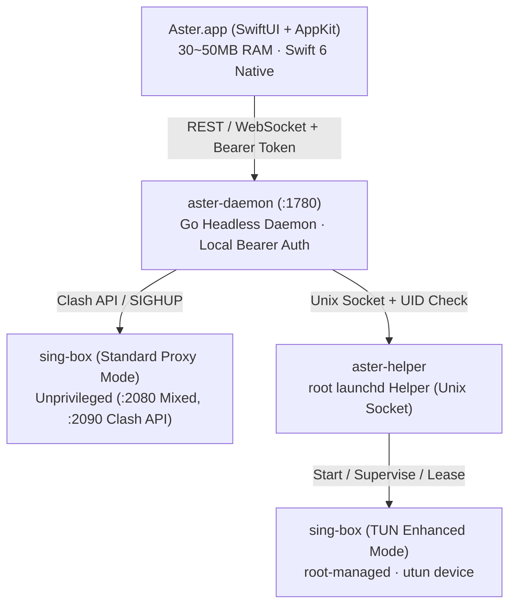

# Aster

<p align="center">
  
</p>

<p align="center">
  <strong>Ultra-lightweight native proxy client engineered for Apple Silicon (macOS 14+)</strong><br/>
  Native <strong>SwiftUI + AppKit</strong> frontend paired with a <strong>Go</strong> headless daemon, driving the high-performance <strong>sing-box</strong> core
</p>

<p align="center">
  <a href="LICENSE"></a>
  <a href="https://github.com/velctmo/Aster/actions/workflows/ci.yml"></a>
  <a href="https://go.dev/"></a>
  <a href="https://developer.apple.com/swift/"></a>
  <a href="https://developer.apple.com/macos/"></a>
  <a href="https://github.com/SagerNet/sing-box"></a>
</p>

<p align="center">
  <a href="README.md"><strong>简体中文</strong></a> •
  <a href="README_EN.md"><strong>English</strong></a>
</p>

---

## 💡 Overview

Aster is a native macOS proxy utility focused on minimal resource usage, fluid system integration, and in-depth network telemetry. Rejecting the bloat and idle CPU drain of cross-platform GUI frameworks, Aster decouples a Swift 6 native interface from a Go headless daemon:

- **Ultra-Low Footprint**: Resident memory strictly within **30MB ~ 50MB**; the native glass floating speed monitor uses ~**0% idle CPU**.
- **Intuitive Telemetry**: Comprehensive Bento dashboard displaying network topology, 3-tier latency breakdowns, and 24-hour traffic waveforms.
- **Zero-SUID Security**: Secure root `launchd` helper using restricted Unix socket and console UID validation for passwordless TUN switching.

---

## ✨ Key Features

- **📊 Network Topology & Bento Dashboard**:
  - Live network interface status, outbound mode switching, and real local IP vs proxy egress IP comparison;
  - Concurrent latency probes for Gateway, recursive DNS, and proxy endpoints in one view;
  - Real-time millisecond upload/download rate oscilloscopes and 24-hour multi-dimensional traffic histograms.
- **⚡️ Native Menu Bar & Streaming UX**:
  - Built on modern `NSPopover`: delay tests keep the popover open while latency lights up progressively via WebSocket;
  - Live top network-active macOS apps with local high-resolution icons;
  - Global shortcuts: `⌘M` (Main Window), `⌘D` (Inspector), `⌘S` (System Proxy), `⌘E` (Enhanced Mode), `⌘C` (Copy Terminal Proxy Exports).
- **🔍 Standalone Packet Inspector (`⌘D`)**:
  - 10-column high-density audit table filterable by client application or target hostname;
  - Right-click any connection to immediately inject permanent DIRECT / PROXY / REJECT routing rules.
- **🛡️ Industrial-Grade Privilege Model**:
  - After installing the network component (`.pkg`) once, toggling TUN mode requires no administrator password prompts;
  - Strictly limited to the console user UID with a 20-second lease auto-shutdown safety mechanism.
- **⚙️ Intelligent Telemetry & Pipeline**:
  - **Passive Sampling**: Passively samples TCP handshake RTT during ordinary web browsing to continuously refine node latencies;
  - **Persistent Rule Pipeline**: Updating subscriptions preserves custom routing rules and DNS configurations;
  - **Zero-Config Sync**: Seamless integration with macOS iCloud Drive and WebDAV backup/restore.

---

## 🏗️ Architecture



---

## 📥 Download & Installation

Download the latest release from the [Releases Page](https://github.com/velctmo/Aster/releases):

1. **Portable Build (`Aster-macos-arm64.zip`)**: Unzip and drag `Aster.app` to `/Applications` to run immediately (for standard system proxy mode).
   > If prompted by Gatekeeper, right-click `Aster.app` in Finder → **Open**, or run `xattr -cr /Applications/Aster.app` in Terminal.
2. **Network Component Installer (`Aster.pkg`)**: Install once to grant system authorization if you need the full-system **TUN Enhanced Mode**.

---

## 🛠️ Building from Source

### Requirements
- Apple Silicon Mac (`arm64`)
- macOS 14.0 or newer
- Go 1.22+, Xcode 15+ or Command Line Tools

```bash
# Clone repository
git clone https://github.com/velctmo/Aster.git
cd Aster

# Run tests
make test

# Build application bundle (outputs build/Aster.app and build/Aster-macos-arm64.zip)
make app

# Build privileged installer package (outputs build/Aster.pkg)
make pkg

# Run application
make run
```

---

## 📄 License

Released under the [MIT License](LICENSE).
