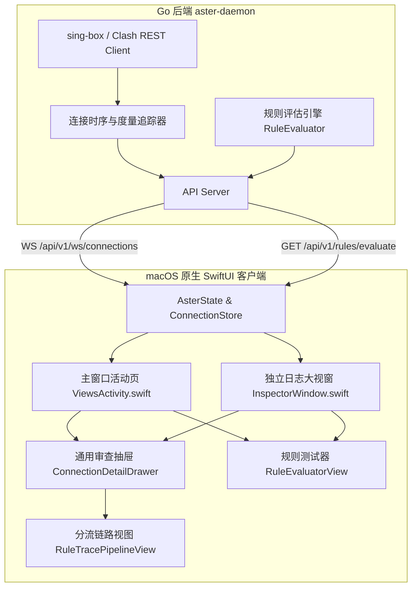

# 进程级请求监控与规则诊断面板设计规范

## 1. 概述与背景

Aster 现已具备基础的连接列表与独立日志视窗，但在深度诊断、规则命中溯源、时序度量及异常原因识别方面与 Surge 等专业工业级工具仍存在差距。
本规范旨在从数据源头到前端展示对 Aster 的连接监控体系进行全面升级，构建全栈联动的**进程级请求监控、异常诊断与规则即时模拟评估系统**。

---

## 2. 系统整体架构

系统采用 **后端引擎仿真评估 + WebSocket 连接时序度量 + 原生多端组件化抽屉** 架构：



---

## 3. 后端详细设计 (`internal/app`, `internal/api`, `internal/clash`)

### 3.1 规则仿真评估引擎 (`GET /api/v1/rules/evaluate`)

在 `internal/app` 中实现规则求值器 `RuleEvaluator`：
- **匹配机制**：
  1. 接收目标主机名、IP、进程名、目标端口与网络协议。
  2. 获取当前活动配置中的完整规则列表（按配置先后顺序）。
  3. 支持的规则类型：
     - `DOMAIN`：全量域名匹配。
     - `DOMAIN-SUFFIX`：域名后缀匹配（如 `apple.com` 匹配 `store.apple.com`）。
     - `DOMAIN-KEYWORD`：域名关键字匹配。
     - `IP-CIDR` / `IP-CIDR6`：IP 网段掩码匹配。
     - `PROCESS-NAME`：发起进程名精确或忽略大小写匹配。
     - `GEOSITE`：预设分类匹配（如 `google`, `cn`）。
     - `GEOIP`：国家/地区地理代码匹配。
     - `MATCH`：终态兜底。
  4. 遇到首个满足条件的规则即短路退出，并确定出站策略。
  5. 若出站策略为选择组（Selector / URLTest），递归解析其当前选中的优选节点。

- **API 端点**：
  - `GET /api/v1/rules/evaluate?target={target}&process={process}&port={port}&network={network}`
  - **响应 JSON**：
    ```json
    {
      "target": "v.qq.com",
      "matched": true,
      "ruleType": "DOMAIN-SUFFIX",
      "payload": "qq.com",
      "outbound": "DIRECT",
      "selectedNode": "DIRECT",
      "evaluationTimeMs": 0.28
    }
    ```

### 3.2 连接时序与生命周期增强 (`clash.Connection`)

在 `internal/clash/client.go` 中扩充连接诊断元数据：
```go
type Connection struct {
    ID          string                 `json:"id"`
    Upload      int64                  `json:"upload"`
    Download    int64                  `json:"download"`
    Start       string                 `json:"start"`
    Chains      []string               `json:"chains"`
    Rule        string                 `json:"rule"`
    RulePayload string                 `json:"rulePayload"`
    Metadata    Metadata               `json:"metadata"`
    Diagnostics ConnectionDiagnostics  `json:"diagnostics"`
}

type ConnectionDiagnostics struct {
    DurationMs   int64  `json:"durationMs"`
    SpeedIn      int64  `json:"speedIn"`
    SpeedOut     int64  `json:"speedOut"`
    CloseReason  string `json:"closeReason"` // "active" | "completed" | "timeout" | "rejected" | "dns_failed" | "reset"
    IsFailed     bool   `json:"isFailed"`
}
```

- **持续时长 `DurationMs`**：`time.Since(startTime).Milliseconds()`，已关闭连接则锁定为闭合时长的固定值。
- **瞬时速率 `SpeedIn / SpeedOut`**：基于前后两秒差值平滑计算 `(currentBytes - lastBytes) / deltaSeconds`。
- **异常原因判定**：
  - `rejected`：规则为 `reject` 或链路包含 `REJECT`。
  - `dns_failed`：连接建立后无握手成功即断开，且 `download == 0 && targetIP == ""`。
  - `timeout`：存续超过设定阈值且对端长时间未响应。
  - `completed`：正常双向关闭并伴随数据包传输。

---

## 4. 前端组件与交互规范 (`macos-native/Sources/Aster/`)

### 4.1 统一分流链路追踪视图 (`RuleTracePipelineView`)
在连接详情抽屉中，提供清晰水平阶梯图：
1. **客户端与发起进程**：带系统高清 App 图标，如 `[📱 Safari (PID: 8129)]`。
2. **DNS 解析与寻址**：显示耗时与解析结果，如 `[🌐 DNS: 12ms (104.18.2.1)]`。
3. **规则引擎判定**：标明规则类型与有效载荷，如 `[🎯 DOMAIN-SUFFIX: cloudflare.com]`。
4. **出站决策与落地**：标明策略组及优选节点，如 `[🚀 Proxy ➔ 🇯🇵 Tokyo-01 (78ms)]`。
5. **传输终态**：`[🏁 传输完成 · 890 KB]`。

### 4.2 诊断微光与状态徽标 (`ConnectionDiagnosticBadge`)
- **实时活跃**：绿色微光呼吸指示点 + 瞬时速率（`↓ 1.2 MB/s`）。
- **正常关闭**：次级标签灰度，带对勾标记（`✓ 2.3s`）。
- **规则阻断**：警示红底（`⊘ 阻断`）。
- **超时异常**：警示橙底（`⏱ 超时`）。
- **DNS 异常**：暗紫底色（`⚠ DNS 异常`）。

### 4.3 通用属性审查抽屉 (`ConnectionDetailDrawer`)
- 提取为独立视图组件，可挂载于主窗口与独立日志窗口。
- 宽度 340pt，具备流畅进出动画（Spring `dampingFraction: 0.82`）。
- 支持一键复制：目标主机、解析 IP、完整链路、进程路径。
- 支持快捷规则操作：一键调出「为目标域名添加规则」与「为进程添加规则」多态弹窗。

### 4.4 规则即时测试器 (`RuleEvaluatorBar`)
- 集成于主窗口活动页与独立日志视窗顶部工具栏。
- 单行高密输入框，支持粘贴 URL、纯域名或 IP，按下回车即刻发起评估。
- 预测结果浮动卡片展示匹配类型、命中规则行、出站目标以及评估耗时。

### 4.5 主窗口活动页 (`ViewsActivity.swift`) 升级
- 工具栏新增搜索框（模糊匹配应用名/域名/IP）、状态分段过滤器（`全部` / `活跃` / `已关闭` / `异常`）、规则测试开关。
- 下方连接列表全面支持点击选中行、高亮背景、键盘 `↑` / `↓` 导航以及 `Esc` 关闭抽屉。

---

## 5. 验证标准

1. **Go 后端自动化测试**：
   - 编写 `internal/app/rule_evaluator_test.go` 验证各种规则匹配的准确性与边界用例。
   - 运行 `go test -count=1 -race ./...`，确保所有包无数据竞争且测试全绿。
2. **Swift 语法与 UI 构建检查**：
   - 运行 `swiftc -parse macos-native/Sources/Aster/*.swift`，保证 0 错误、0 警告。
3. **功能验证**：
   - 模拟规则测试接口返回预期命中结果。
   - 连接列表点击行能够顺畅滑出审查抽屉，链路图与度量指标显示准确。
